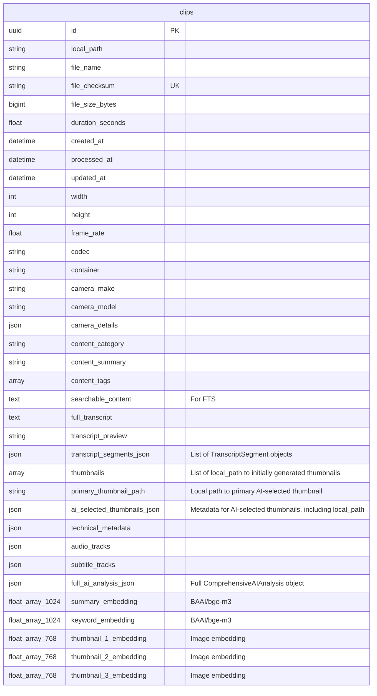

# DuckDB Schema and CRUD Layer Design Plan

**Version:** 1.1
**Date:** 2025-05-30

## 1. Objective

To create a streamlined and efficient DuckDB database backend for the AI Ingesting Tool. This involves:
*   Defining a simplified DuckDB schema consisting solely of a comprehensive `clips` table, which will consolidate all per-video data including metadata, transcript details, full AI analysis, and vector embeddings.
*   Developing a Python-based CRUD (Create, Read, Update, Delete) layer to interact with DuckDB, tailored to this simplified schema and supporting the existing application's data ingestion (via `/api/ingest`) and access patterns.
*   Adapting existing search logic (FTS and semantic) to work with the new schema in DuckDB.
*   Detailing necessary modifications to existing Prefect tasks to integrate with the new DuckDB backend.

## 2. Final DuckDB Schema (Simplified)

The DuckDB schema will consist of a single primary table in the `app_data` schema: `clips`.

**Mermaid Diagram (Final Simplified Schema):**



**`CREATE TABLE` Statements (Conceptual for DuckDB):**
(To be implemented in `video_ingest_tool/database/duckdb/schema.py`)

*   **`app_data.clips`:**
    ```sql
    CREATE TABLE IF NOT EXISTS app_data.clips (
        id UUID PRIMARY KEY,
        local_path VARCHAR NOT NULL,
        file_name VARCHAR NOT NULL,
        file_checksum VARCHAR UNIQUE NOT NULL,
        file_size_bytes BIGINT NOT NULL,
        duration_seconds DOUBLE,
        created_at TIMESTAMP,
        processed_at TIMESTAMP,
        updated_at TIMESTAMP,
        width INTEGER,
        height INTEGER,
        frame_rate DOUBLE,
        codec VARCHAR,
        container VARCHAR,
        camera_make VARCHAR,
        camera_model VARCHAR,
        camera_details JSON,
        content_category VARCHAR,
        content_summary TEXT,
        content_tags VARCHAR[],
        searchable_content TEXT,
        full_transcript TEXT,
        transcript_preview VARCHAR,
        transcript_segments_json JSON,
        thumbnails VARCHAR[],
        primary_thumbnail_path VARCHAR,
        ai_selected_thumbnails_json JSON,
        technical_metadata JSON,
        audio_tracks JSON,
        subtitle_tracks JSON,
        full_ai_analysis_json JSON,
        summary_embedding FLOAT[1024],
        keyword_embedding FLOAT[1024],
        thumbnail_1_embedding FLOAT[768],
        thumbnail_2_embedding FLOAT[768],
        thumbnail_3_embedding FLOAT[768]
    );
    ```

**Indexes for `app_data.clips`:**
*   **FTS Index:**
    ```sql
    PRAGMA create_fts_index('app_data.clips', 'id', 'searchable_content', 'file_name', 'content_summary', 'transcript_preview', 'content_tags', overwrite=1);
    ```
*   **HNSW Indexes on embedding columns:**
    ```sql
    CREATE INDEX IF NOT EXISTS idx_clips_summary_vec ON app_data.clips USING HNSW (summary_embedding);
    CREATE INDEX IF NOT EXISTS idx_clips_keyword_vec ON app_data.clips USING HNSW (keyword_embedding);
    CREATE INDEX IF NOT EXISTS idx_clips_thumb1_vec ON app_data.clips USING HNSW (thumbnail_1_embedding);
    CREATE INDEX IF NOT EXISTS idx_clips_thumb2_vec ON app_data.clips USING HNSW (thumbnail_2_embedding);
    CREATE INDEX IF NOT EXISTS idx_clips_thumb3_vec ON app_data.clips USING HNSW (thumbnail_3_embedding);
    ```
*   **Standard B-Tree Indexes:**
    ```sql
    CREATE INDEX IF NOT EXISTS idx_clips_file_checksum ON app_data.clips (file_checksum);
    CREATE INDEX IF NOT EXISTS idx_clips_created_at ON app_data.clips (created_at DESC);
    ```

## 3. Data Population Strategy for `clips` Table Columns

The `VideoIngestOutput` model (from `video_ingest_tool/models.py`) will be the primary source for preparing data for the `clips` table. This mapping logic will be implemented in a dedicated module, `video_ingest_tool/database/duckdb/mappers.py`. A function within this module (e.g., `prepare_clip_data_for_db(video_output: VideoIngestOutput, embeddings: Dict[str, List[float]], ai_selected_thumbnail_metadata: Optional[List[Dict[str, Any]]]) -> Dict[str, Any]`) will take `VideoIngestOutput`, `embeddings`, and the processed `ai_selected_thumbnail_metadata` (output from `ai_thumbnail_selection_step`, containing paths and ranks) as input and return a dictionary formatted for the `clips` table.

The mapping will involve:
*   **Most metadata fields:** Directly mapped from `VideoIngestOutput.file_info`, `.video`, `.camera`, `.analysis`.
*   **`searchable_content`:** Generated by a helper function (e.g., `_generate_searchable_content` within `mappers.py`) using various fields from `VideoIngestOutput` (logic similar to current `generate_searchable_content` from `video_ingest_tool/database_storage.py`).
*   **`full_transcript`, `transcript_preview`:** From `VideoIngestOutput.analysis.ai_analysis.audio_analysis.transcript.full_text`.
*   **`transcript_segments_json`:** From `VideoIngestOutput.analysis.ai_analysis.audio_analysis.transcript.segments` (serialized list of `TranscriptSegment` objects).
*   **`thumbnails`:** List of local file paths from `VideoIngestOutput.thumbnails` (initially generated thumbnails).
*   **`primary_thumbnail_path`:** Local file path of the rank 1 AI-selected thumbnail, derived by the mapper from the `ai_selected_thumbnail_metadata` argument (which is the processed output of `ai_thumbnail_selection_step`).
*   **`ai_selected_thumbnails_json`:** Structured metadata for AI-selected thumbnails, taken directly from the `ai_selected_thumbnail_metadata` argument (which includes local paths).
*   **JSON fields** (`camera_details`, `technical_metadata`, `audio_tracks`, `subtitle_tracks`): Serialized from corresponding Pydantic sub-models in `VideoIngestOutput`.
*   **`full_ai_analysis_json`:** The entire `VideoIngestOutput.analysis.ai_analysis` (`ComprehensiveAIAnalysis` model) object serialized to JSON.
*   **Embedding Columns:** Populated with vectors generated by `generate_embeddings_step`.
    *   Source for `summary_embedding`: Text derived by `prepare_embedding_content` (from `video_ingest_tool/embeddings.py`) using AI summary, location, visual style, content purpose from `VideoIngestOutput`.
    *   Source for `keyword_embedding`: Text derived by `prepare_embedding_content` using full transcript, visual concepts, activity concepts, category, and technical metadata from `VideoIngestOutput`.
    *   Source for `thumbnail_X_embedding`: AI-selected thumbnail image files (local paths).

## 4. Python CRUD Layer Design (`video_ingest_tool/database/duckdb/crud.py`)

This new module will provide a clean interface for all database operations with DuckDB.
*   **Connection Handling:** Use `video_ingest_tool/database/duckdb/connection.py`.
*   **Key Functions (Illustrative):**
    *   `upsert_clip_data(clip_data: Dict[str, Any], conn: duckdb.DuckDBPyConnection) -> Optional[str]`: Primary function for data ingestion. Expects a pre-formatted dictionary (`clip_data`) matching the `clips` table schema and performs an INSERT or UPDATE (upsert) using an `ON CONFLICT` clause.
    *   `get_clip_details(clip_id: str, conn: duckdb.DuckDBPyConnection) -> Optional[Dict[str, Any]]`.
    *   `find_clip_by_checksum(checksum: str, conn: duckdb.DuckDBPyConnection) -> Optional[Dict[str, Any]]`.
    *   `delete_clip_by_id(clip_id: str, conn: duckdb.DuckDBPyConnection) -> bool`.
    *   `get_all_clips(conn: duckdb.DuckDBPyConnection, limit: int = 100, offset: int = 0) -> List[Dict[str, Any]]`.
*   **Transaction Management:** Handled by DuckDB for single statements or via explicit transaction blocks if multiple operations are grouped. The `ON CONFLICT` clause in `upsert_clip_data` handles atomicity for that specific operation. Search functions are detailed in Section 7 and implemented in `search_logic.py`.

## 5. Modifications to Existing Prefect Tasks

Key Prefect tasks will need modification to integrate with the DuckDB backend:
*   **`database_storage_step` (from `video_ingest_tool/tasks/storage/database_storage.py`):**
    *   **Current:** Calls Supabase-specific `store_video_in_database`.
    *   **Change:** This task (or a new `duckdb_storage_task`) will now receive `VideoIngestOutput` and generated embeddings. It will first call a mapping function from `video_ingest_tool/database/duckdb/mappers.py` (e.g., `mappers.prepare_clip_data_for_db(video_output, embeddings)`) to get a formatted dictionary. Then, it will use the `video_ingest_tool/database/duckdb/crud.py` module (e.g., `crud.upsert_clip_data(prepared_data, conn)`) to persist data into the DuckDB `clips` table.
*   **`generate_embeddings_step` (from `video_ingest_tool/tasks/storage/embeddings.py`):**
    *   **Current:** Calls `store_embeddings` which writes to Supabase `vectors` table.
    *   **Change:** The call to `store_embeddings` will be removed. The task will return the generated embedding vectors (`summary_embedding`, `keyword_embedding`, `thumbnail_1/2/3_embedding`) as part of its output. These will then be passed to the new DuckDB storage task.
*   **`check_duplicate_step` (from `video_ingest_tool/tasks/processing/duplicate_check.py`):**
    *   **Current:** Likely queries Supabase `clips` table by `file_checksum`.
    *   **Change:** Will be updated to query the DuckDB `clips` table using the new CRUD layer (e.g., `crud.find_clip_by_checksum(...)`).

## 6. Integration with Ingest Process

The Prefect flow `process_video_file_task` (`video_ingest_tool/flows/prefect_flows.py`) will be adjusted:
1.  Steps up to and including `generate_embeddings_step` will run. `generate_embeddings_step` now returns the embeddings.
2.  The existing `database_storage_step` will be replaced/refactored into a new DuckDB-specific storage task (e.g., `save_to_duckdb_task`).
3.  This new task receives `VideoIngestOutput` and the embeddings. It first calls the mapping function (e.g., from `video_ingest_tool/database/duckdb/mappers.py`) to prepare the `clip_data` dictionary, then uses `video_ingest_tool/database/duckdb/crud.upsert_clip_data(clip_data, conn)` to save data.

## 7. Search Functionality Adaptation

*   Logic from existing Supabase SQL search functions (e.g., `hybrid_search_clips`) will be re-implemented in Python within `video_ingest_tool/database/duckdb/search_logic.py`.
*   These functions will use DuckDB's FTS on `clips.searchable_content` and vector search (HNSW) on embedding columns in the `clips` table, as invoked by functions in `search_logic.py`.
*   Hybrid search, combining FTS and semantic scores, will be orchestrated by functions in `search_logic.py`.

## 8. Testing Strategy

*   Unit tests for `video_ingest_tool/database/duckdb/schema.py`.
*   Unit tests for `video_ingest_tool/database/duckdb/crud.py` using an in-memory DuckDB.
*   Integration tests for the modified Prefect flow.

## 9. Documentation

*   This document (`duckdb_schema_crud_design_plan.md`) will serve as the primary design reference.
*   Update `video_ingest_tool/database/duckdb/schema.py` with final DDL.
*   Document the API of `video_ingest_tool/database/duckdb/crud.py`.
*   Update the main `duckdb_migration_plan.md`.